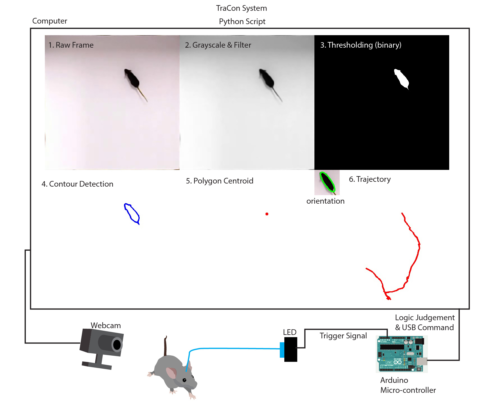
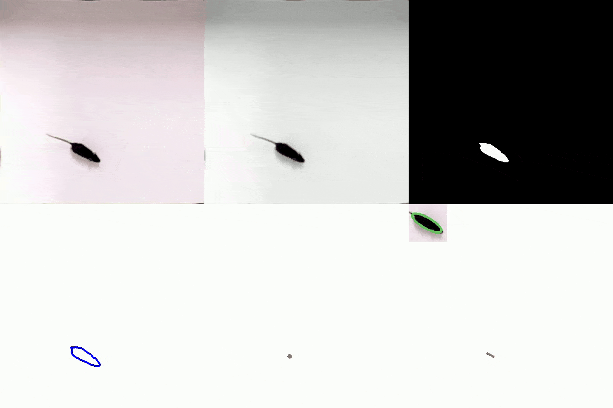
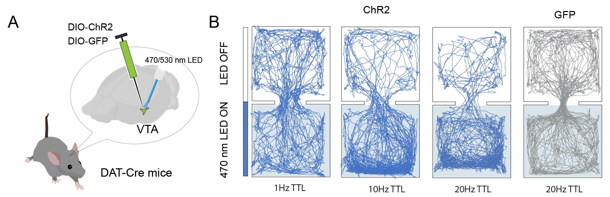
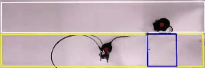
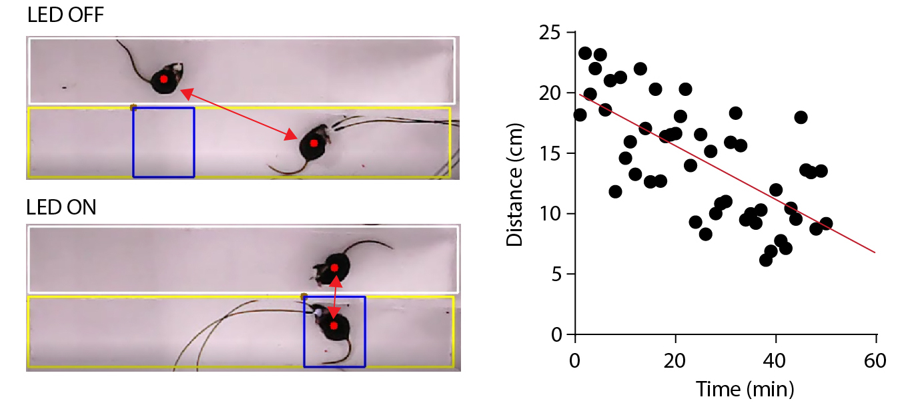

# Track-and-Control(TraCon)-Toolbox
## Real-time animal detection
#### The architecutre of the TraCon System


TraCon can achieve real-time animal detection and output statistic results for standard behavior tests, for example, open field test, elevated plus maze test, Morris water maze, social preference test, et. al.

## Closed-loop feedback control


Upon successful detection, we can define a spatial region that would trigger the optogenetic or a sensory stimulation. Here we used two-chamber real-time place preference for demonstration. In our previous study, we used this method  [Zhang, et al. 2018 Neuron](https://www.researchgate.net/publication/327064654_Transforming_Sensory_Cues_into_Aversive_Emotion_via_Septal-Habenular_Pathway)

## Dynamic region for closed-loop control
<p align="center">
  
</p>


Moreover, the spatial region can be either static, as used in two-chamber place preference test, or dynamic, which changes accordingly to the position of another animal.    

## Introduction of TraCon

TraCon toolbox is video-based and written in Python programming language (compatible with Python 2 and Python 3) that can work on Windows, Max OS and Linux system. Due to the low computation requirements, TraCon can run at a single core CPU only computer for real time object detection and feedback control. Considering most neuroscience labs have laser/LED components or customized sensory stimulation, TraCon toolbox can be easily integrated with existing laboratory rig to achieve automation. 


## Step-by-step Video Tutorial
This part is still under development. You may subscript to the mailing list to receive notification regarding the update:
https://docs.google.com/spreadsheets/d/1bvRgqYsHoxdKriIWadSp18Iz_6pi-RCWazMIVA_AIbg/edit?usp=sharing

Or you may check the Youtube channel in the future:
https://www.youtube.com/channel/UCMS8gQo8F_oKKvzGmNWnZBw?view_as=subscriber


## Getting Started

Here we describe our Track-and-Control (TraCon) toolbox, a fully automatic system with real-time object detection and low latency closed-loop hardware feedback. We further demonstrate that the toolbox can be applied in a broad spectrum of behavior tests in the neuroscience field, including open field, cross maze, Morris water maze, real-time place preference, social interaction, and looming-induced defensive behavior tests. TraCon toolbox proved to be an efficient and easy-to-use method, and highly flexible for extension. Moreover, the toolbox is open source and compatible across OS platforms and each lab can easily integrate TraCon with their existing set up to achieve automation. And we hope TraCon toolbox would further accelerate our understanding of the functional architecture of the brain. 

### Prerequisites

1.Python environment and OpenCV library for the object detection analysis.
2.Arduino board for TTL pulse train generation.

This instruction would go through every detail you might need to know while install the TraCon toolbox.


### Intallation

### Windows Users
Installation instruction for windows users:
This installation has been tested in Windows 10 and 7 system

#### Install Python environment:
1.	Download [anaconda](www.anaconda.com/distribution/)
2.	Chose the Python 3.7 version, 64-Bit Graphic Installer (486MB)
3.	After completion of the download, open the Anaconda3-2019.07-Windows-x86_64.exe installer file
4.	Follow the intuitive installation instruction and chose ‘Add Anaconda to the system PATH environment variable’ during the installation’ and ‘Register Anaconda as the system Python 3.7’

#### Install OpenCV
1.	Open Anaconda Prompt (Anaconda3)
2.	In the command line:
```
pip install opencv-contrib-python
```
#### Install USB serial control Package
1.	Open Anaconda Prompt (Anaconda3)
2.	Type in:
```
pip install pyserial 
```
#### Execution of the code
1.	Open Anaconda and run Spyder
2.	Open the python files downloaded from [here](http://github.com/GuangWei-Zhang/TraCon-Toolbox/Python_scripts)
3.	Use the default setting of the system.


## Running the tests


## Deployment


## Built With

* [Python](https://www.python.org) - programming language
* [OpenCV](https://opencv.org) - Image processing library
* [Pyserial](https://pypi.org/project/pyserial/) - Serial Port Control
* [Arduino](https://www.arduino.cc) - open-source and easy-to-use micro controller board 

## Contributing

Please read [CONTRIBUTING.md](https://gist.github.com/PurpleBooth/b24679402957c63ec426) for details on our code of conduct, and the process for submitting pull requests to us.

## Versioning

We use [SemVer](http://semver.org/) for versioning. For the versions available, see the [tags on this repository](https://github.com/your/project/tags). 

## Authors

* **Guang-Wei Zhang** - *Initial work* - [TraCon-Toolbox](https://github.com/guangWei-Zhang/)

See also the list of [contributors](https://github.com/guangWei-Zhang/TraCon-Toolbox/contributors) who participated in this project.

## License

This project is licensed under the MIT License - see the [LICENSE.md](LICENSE.md) file for details

## Acknowledgments

* Hat tip to anyone whose code was used
* Inspiration
* etc
